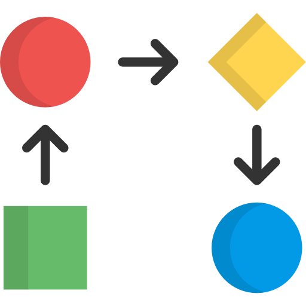
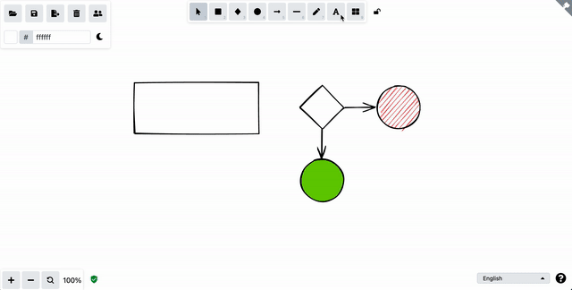

#  Excalidraw Converter 

**A command line tool for porting Excalidraw diagrams to Gliffy and draw.io.** 

[Excalidraw](https://excalidraw.com/) is great for sketching diagrams as part of a design process, but chances are that you have to redo those sketches for documentation. This tool is made to bridge those tasks.

Excalidraw Converter ports Excalidraw diagrams to a Gliffy compatible format, which can be imported directly into services like [Gliffy](https://www.gliffy.com/), [Gliffy for Confluence](https://marketplace.atlassian.com/apps/254/gliffy-diagrams-for-confluence), [draw.io](https://draw.io) or [draw.io for Confluence](https://www.drawio.com/doc/drawio-confluence-cloud).


## Getting started

### Installation
#### MacOS with [Homebrew](https://brew.sh/)
```shell
brew install sindrel/tap/excalidraw-converter
```

#### Installation for other OSes
Download a compatible binary from the [Releases](https://github.com/sindrel/excalidraw-converter/releases) page.

If you're a Linux or MacOS user, move it to your local bin folder to make it available in your environment (optional).

### How to convert diagrams
First save your Excalidraw diagram to a file.

Then, to do a conversion, simply execute the binary by specifying the `gliffy` command, and the path to your Excalidraw file.

```sh
exconv gliffy -i ~/Downloads/my-diagram.excalidraw
```

<details>
  <summary>MacOS example</summary>

  ```sh
  $ exconv gliffy -i ~/Downloads/my-diagram.excalidraw
  Parsing input file: ~/Downloads/my-diagram.excalidraw
  Adding object: com.gliffy.shape.basic.basic_v1.default.rectangle
  Adding object: com.gliffy.shape.basic.basic_v1.default.text
  [...]
  Adding object: com.gliffy.shape.basic.basic_v1.default.text
  Adding object: com.gliffy.shape.basic.basic_v1.default.line
  Converted diagram saved to file: my-diagram.gliffy
  ```
</details>

<details>
  <summary>Linux example</summary>

  ```sh
  $ ./exconv gliffy -i ~/Downloads/my-diagram.excalidraw
  Parsing input file: ~/Downloads/my-diagram.excalidraw
  Adding object: com.gliffy.shape.basic.basic_v1.default.rectangle
  Adding object: com.gliffy.shape.basic.basic_v1.default.text
  [...]
  Adding object: com.gliffy.shape.basic.basic_v1.default.text
  Adding object: com.gliffy.shape.basic.basic_v1.default.line
  Converted diagram saved to file: my-diagram.gliffy
  ```
</details>

<details>
  <summary>Windows example</summary>

  ```sh
  C:\> exconv.exe gliffy -i C:\Downloads\my-diagram.excalidraw
  Parsing input file: C:\Downloads\my-diagram.excalidraw
  Adding object: com.gliffy.shape.basic.basic_v1.default.rectangle
  Adding object: com.gliffy.shape.basic.basic_v1.default.text
  [...]
  Adding object: com.gliffy.shape.basic.basic_v1.default.text
  Adding object: com.gliffy.shape.basic.basic_v1.default.line
  Converted diagram saved to file: my-diagram.gliffy
  ```
</details>  

### Importing


After converting your diagram(s), import them into Gliffy (or draw.io) using the standard Import dialog.

## Commands
```sh
Available Commands:
  completion  Generate the autocompletion script for the specified shell
  gliffy      Convert an Excalidraw diagram to Gliffy format
  help        Help about any command
  snap        Snap a diagram to a grid
  version     Output the application version

Flags:
  -h, --help   help for exconv
```

### Gliffy conversion options  
When an output file path is not provided, it will be determined
automatically based on the filename of the input file. If you provide the
input file path `./subfolder/your_file.excalidraw`, the default output file path will be `./your_file.gliffy`.

This can be overridden using the `-o` flag.

```sh
Example:
  exconv gliffy -i your_file.excalidraw

Usage:
  exconv gliffy [flags]

Flags:
  -g, --grid-size string   diagram grid size (default "20")
  -h, --help               help for gliffy
  -i, --input string       input file path
  -o, --output string      output file path (default "your_file.gliffy")
  -s, --snap-grid          snap diagram objects to grid
```

### Snapping to grid :sparkles:
Resizing and alignment of objects to a grid. This can be useful to 
quickly clean up sketches that are out of alignment. Objects will be
resized to fit the grid and placed along the lines of the grid.

It can also be used in-line when using the `gliffy` command.

```sh
Example:
  exconv snap -i your_file.excalidraw

Usage:
  exconv snap [flags]

Flags:
  -g, --grid-size string   grid size (default "20")
  -h, --help               help for snap
  -i, --input string       input file path
  -o, --output string      output file path (default "your_file0.excalidraw")
```

## Features

All fixed shapes and most styling and text options are supported.

### Shapes
* Rectangle
* Rounded rectangle
* Diamond
* Ellipse
* Arrow
* Line
* Image :sparkles:
* Free drawing (pencil tool) :sparkles:

### Text
* Font family (Normal and Code)
* Font size
* Font color
* Horizontal and vertical alignment :sparkles:
* Text contained in shapes

### Styling
* Canvas background color
* Fill color
* Fill style (hachure and cross-hatch translate to gradients)
* Stroke color
* Stroke width
* Opacity

Library graphics are not fully supported (experimental).

## Compatibility with draw.io
Converted Gliffy diagrams should also work in [draw.io](https://draw.io).

In draw.io, you can import a diagram by simply opening the file from your device. If you're using draw.io for Confluence, you should be able use [the import dialog](https://drawio-app.com/blog/draw-io-for-confluence-now-with-gliffy-import/).

## Contributing
See something you'd like to improve? Great! See the [contributing guidelines](CONTRIBUTING.md) for instructions.

## Attributions  
* <a href="https://www.flaticon.com/free-icons/workflow" title="workflow icons">Workflow icons created by Freepik - Flaticon</a>

## Development
<details>
  <summary>Instructions</summary>

### Prerequisites:
* Go (see version in `go.mod`)

### Download dependencies
```shell
go mod download
```

### Run tests
```shell
go test -v ./...
```

### Compile and run
```shell
go run ./cmd/main.go <command> <arguments>
```

</details>
